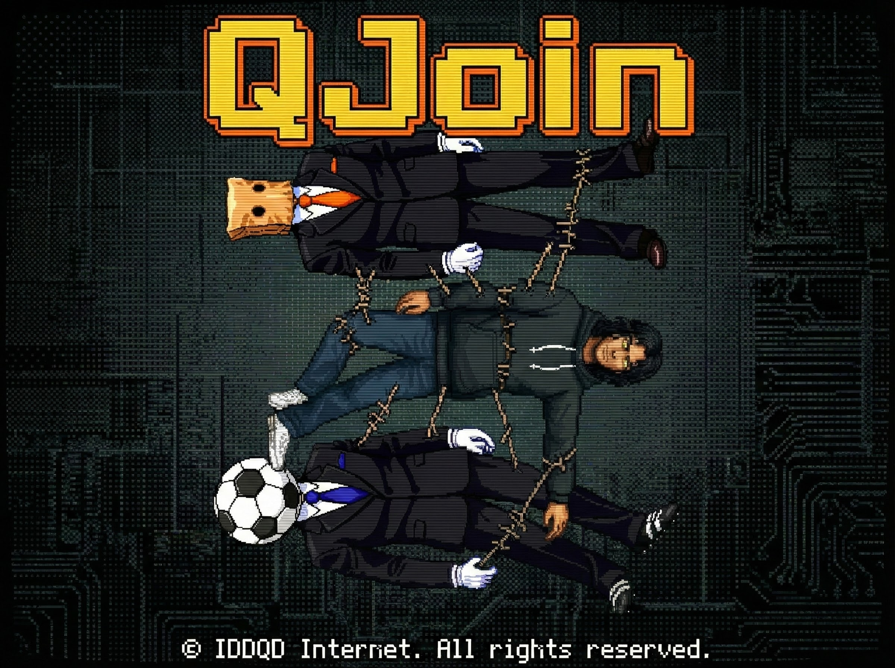

# Q Join

[한국어](./README.ko.md)

A pure client-side tool to vertically stitch multiple images into one long image. Simply drag and drop PNG or JPG files, and they will be automatically sorted by filename and joined from top to bottom. The processed image can be downloaded immediately as PNG or JPG without any server processing.

# Our Philosophy
IDDQD Internet builds zero-DB, zero-signup tools powered by pure HTML/JS for instant browser execution. Even with AI features, we keep it stateless and record-free.

# Link
- [Run Q Join](https://app.iddqd.kr/join/)
*(Runs instantly in browser)*

# Splash

# Features
- **Vertical Stitching**: Merges multiple images into a single vertical strip.
- **Smart Sorting**: Automatically sorts files by name (e.g., 1.png, 2.png, 10.png) before merging.
- **Client-Side Processing**: All image manipulation happens in your browser using HTML5 Canvas; no images are uploaded.
- **Multiple Formats**: Export the final result as PNG, JPG (Quality 80), or JPG (Quality 100).
- **Drag & Drop**: Intuitive interface to easily add multiple files at once.
- **Size Preview**: Displays the file size of inputs and allows for easy preview of the joined result.

# Usage
1. Open the application in your web browser.
2. Drag and drop images into the drop zone or click **Select Files** to choose them.
3. Review the file list to ensure they are sorted correctly.
4. Click **Merge Images** to create the joined image.
5. Click **Download PNG**, **Download JPG (Q 80)**, or **Download JPG (Q 100)** to save the result.

# Tech Stack
- **Core**: HTML5, CSS3, JavaScript (ES6+)
- **Libraries**: jQuery 3.7.1, Bootstrap 5.3.3
- **Rendering**: HTML5 Canvas API for image manipulation.

# Contact & Author
Park Sil-jang
- Dev Team Lead at IDDQD Internet. E-solution & E-game Lead. Bushwhacking Code Shooter. Currently executing mandates as Choi’s Schemer.
- HQ (EN): https://en.iddqd.kr/
- GitHub: https://github.com/iddqd-park
